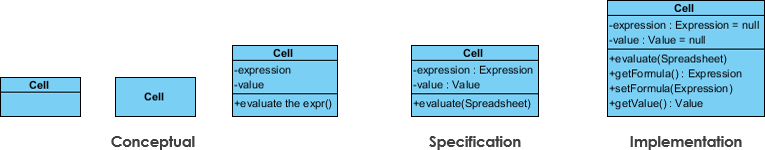
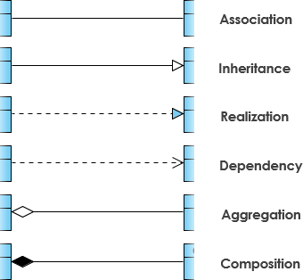

# **UML диаграммы** 

## Определение

**Unified Modeling Language (UML)** — это стандарт для описания, проектирования и документирования программных систем с использованием визуальных диаграмм.

## Преимущества и недостатки

### Преимущества UML
- **Стандартизация**. Схема понятна любому человеку, кто знает UML.
- **Полнота**. В языке уже предусмотрены конкретные реализации для всех сущностей, необходимых в схеме. 
- **Распространенность**. UML используется во многих сферах деятельности. 
- **Инструменты для автоматизации**. Они позволяют автоматически генерировать схемы UML на основе кода.

### Недостатки UML
- **Объёмная документация.** 700 страниц.
- **Сложность использования и поддержки проектов.** Некоторые инструменты для работы с UML могут показаться сложными или недостаточно интуитивными.
- **Семантическая неоднозначность.** Язык не всегда придерживается строгих обозначений, и это усложняет работу с ним.
- **Несовместимость с мелкими проектами.** UML разработали, чтобы моделировать большие и сложные системы. Поэтому использовать его для небольших — это избыточно и неэффективно.

## Типы UML-диаграмм

Все UML диаграммы можно поделить на **структурные** и **поведенческие**.

### Структурные диаграммы

Отображают статическую, неизменную структуру системы, включая классы, их взаимоотношения, компоненты и связи.

- **Диаграмма классов**: Показывает классы, их атрибуты, методы и связи между ними. Пример: структура данных и общие принципы взаимодействия объектов.
- **Диаграмма объектов**: Конкретный пример диаграммы классов, но с активными экземплярами (объектами) и их текущими атрибутами.
- **Диаграмма компонентов**: Показывает, из каких модулей или частей состоит система (например, файлы, библиотеки).
- **Диаграмма развертывания**: Определяет физическое размещение компонентов программного обеспечения и оборудования.
- **Диаграмма пакетов**: Представляет логическую группировку элементов (классов, компонентов) в пакеты. 
- **Диаграмма составной структуры**: Показывает внутреннюю структуру класса или компонента. Используется для отображения разбиения внутри сложных элементов.

### Поведенческие диаграммы

Отображают динамическое поведение системы, её взаимодействия и изменения во времени.

- **Диаграмма использования (use case)**: Показывает взаимодействие пользователей/актеров с системой, их цели и привязку к функциональности.
- **Диаграммы последовательностей (sequence diagram)**: Отображают временной порядок вызовов и взаимодействий между объектами.
- **Диаграмма состояний**: Отображает состояния объекта и переходы между ними в зависимости от событий.
- **Диаграмма активностей**: Указывает на последовательность выполнения операций (например, бизнес-процессы).
- **Диаграмма связи**: Показывает взаимодействие между объектами.
- **Диаграмма обзора взаимодействия**: Объединяет несколько диаграмм последовательностей для отображения сложных взаимодействий.
- **Временная диаграмма**: Отображает изменения состояния объекта или системы во времени.

### Примеры структурных диаграмм

1. **Диаграмма классов**. Показывает классы, их атрибуты, методы и связи между ними.

1.1. Представление классов

Каждый класс представлен в виде прямоугольника, разделенного на три секции:

    - **Имя класса** (в верхней секции).
    - **Атрибуты** (в средней секции) — свойства объекта, его описание.
    - **Методы** (в нижней секции) — действия, которые может выполнять объект.

В диаграмме классов обязательное поле имя класса. 

1.2. Модификаторы области видимости

Модификаторы области видимости указываются перед атрибутами и методами:

    - `+` public (публичный).
    - `-` private (приватный).
    - `#` protected (защищенный).
    - `~` package (пакет).

1.3. Параметры направленности:

Параметр направленности показывает направление относительно вызывающего объекта:

    - `in` — входной параметр.
    - `out` — выходной параметр.
    - `inout` — параметр InOut служит как входом, так и выходом.

1.4. Перспективы диаграммы:

1. **Концептуальная перспектива** - диаграмма интерпретируется как описание вещей в реальном мире. Без привязки к языку.
2. **Спецификационная перспектива** - диаграмма интерпретируется как описание абстракций программного обеспечения или компонентов со спецификациями и интерфейсами, но без привязки к конкретной реализации.
3. **Имплементационная перспектива** - диаграмма интерпретируется, как описание реализация на определенном языке.

1.5. Типы отношений

1.5.1. Взаимосвязи объектов классов

- **[Ассоциация](class_diagram/association) (association)** — структурная связь между классами, обозначающая их взаимодействие.
- **[Агрегация](class_diagram/aggregation) (aggregation)** — слабая связь, где один класс является частью другого, но может существовать независимо.
- **[Композиция](class_diagram/composition) (composition)** — сильная связь, где один класс не может существовать без другого.
- **[Зависимость](class_diagram/dependency) (dependency)** — временная связь (например, при использовании объекта в методе). Объект не хранится ни в одном поле другого объекта.

1.5.1. Взаимосвязи классов

- **[Наследование](class_diagram/generalization) (generalization)** — связь между родительским и дочерним классом.
- **[Реализация](class_diagram/realization) (realization)** — связь между интерфейсом и классом, который его реализует.

1.6. Мощность отношений (Кратность)

Мощность отношения (мультипликатор) означает число связей между каждым экземпляром класса (объектом) в начале линии с экземпляром класса в её конце. Различают следующие типичные случаи:

| _нотация_          | _объяснение_               | _пример_                                      |
|--------------------| -------------------------- | --------------------------------------------- |
| **0..1**           | Ноль или один экземпляр    | Кошка имеет хозяина.                          |
| **1**              | Обязательно один экземпляр | у кошки одна мать                             |
| **0..*** или ***** | Ноль или более экземпляров | у кошки могут быть, а может и не быть котят   |
| **1..***           | Один или более экземпляров | у кошки есть хотя бы одно место, где она спит |
